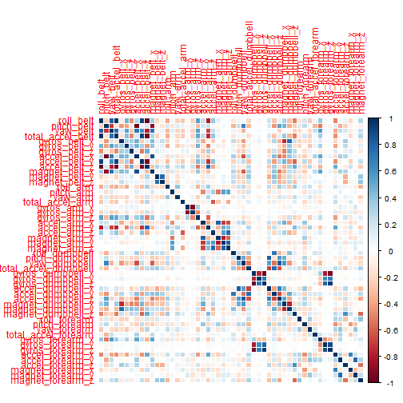
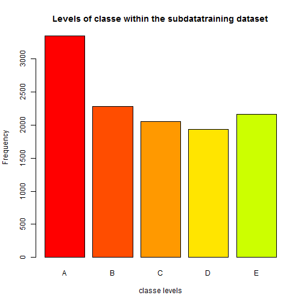
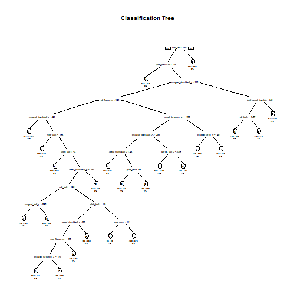

## Introduction

Using devices such as Jawbone Up, Nike FuelBand, and Fitbit it is now possible to collect a large amount of data about personal activity relatively inexpensively. These type of devices are part of the quantified self movement - a group of enthusiasts who take measurements about themselves regularly to improve their health, to find patterns in their behavior, or because they are tech geeks. One thing that people regularly do is quantify how much of a particular activity they do, but they rarely quantify how well they do it. In this project, your goal will be to use data from accelerometers on the belt, forearm, arm, and dumbell of 6 participants. They were asked to perform barbell lifts correctly and incorrectly in 5 different ways. More information is available from the website here: http://groupware.les.inf.puc-rio.br/har (see the section on the Weight Lifting Exercise Dataset).

## Data Proccessing 
The data for this project come from this source: http://groupware.les.inf.puc-rio.br/har. If you use the document you create for this class for any purpose please cite them as they have been very generous in allowing their data to be used for this kind of assignment.

The training data for this project are available here:

https://d396qusza40orc.cloudfront.net/predmachlearn/pml-training.csv

The test data are available here:

https://d396qusza40orc.cloudfront.net/predmachlearn/pml-testing.csv

downloading the data


```r
setwd("C:/Users/Rodrigo/Documents/PredictionAssignment/")
knitr::opts_chunk$set(echo = TRUE)
if (!file.exists("trainfile")) {
    download.file(
        "https://d396qusza40orc.cloudfront.net/predmachlearn/pml-training.csv",
        destfile = "pml-training.csv")
}
if (!file.exists("testfile")) {
    download.file(
        "https://d396qusza40orc.cloudfront.net/predmachlearn/pml-testing.csv",
        destfile = "pml-testing.csv")
}

trainfile <- "pml-training.csv"
testfile  <- "pml-testing.csv"
```
loading libraries


```r
library(rpart)#for regressive partitioning.
library(rpart.plot)# for decision tree plot.
library(caret)
library(corrplot)
library(manipulate)
library(xtable)
library(ggplot2)
library(lattice)
library(knitr)
library(markdown)
library(randomForest)# just in case i need to generate one for regression
```
###cleaning data, making it tidy.


```r
datatraining <- read.csv(trainfile,na.strings=c("NA","#DIV/0!",""))
datatesting <- read.csv(testfile,na.strings=c("NA","#DIV/0!",""))
```
taking out all the columns with missing values 


```r
datatraining <- datatraining[,colSums(is.na(datatraining)) == 0]
datatesting <- datatesting[,colSums(is.na(datatesting)) == 0]
```
taking out all variables that are not of interest

```r
datatraining <- datatraining[,-c(1:7)]
datatesting <- datatesting[,-c(1:7)]
```

the dimmensions of the data


```r
dim(datatraining)
```

```
## [1] 19622    53
```

```r
dim(datatesting)
```

```
## [1] 20 53
```

```r
table(datatraining$classe)
```

```
## 
##    A    B    C    D    E 
## 5580 3797 3422 3216 3607
```

#Partitioning to allow cross-validation
The training data set is partionned into 2 sets: subdatatraining 60% and subdatatesting 40%.


```r
set.seed(1)#for reproducability
subsamples <- createDataPartition(y=datatraining$classe, p=0.60, list=FALSE)
subdatatraining <- datatraining[subsamples, ] 
subdatatesting <- datatraining[-subsamples, ]
dim(subdatatraining)
```

```
## [1] 11776    53
```

```r
dim(subdatatesting)
```

```
## [1] 7846   53
```

```r
head(subdatatraining)
```

```
##   roll_belt pitch_belt yaw_belt total_accel_belt gyros_belt_x gyros_belt_y
## 2      1.41       8.07    -94.4                3         0.02         0.00
## 3      1.42       8.07    -94.4                3         0.00         0.00
## 4      1.48       8.05    -94.4                3         0.02         0.00
## 5      1.48       8.07    -94.4                3         0.02         0.02
## 7      1.42       8.09    -94.4                3         0.02         0.00
## 8      1.42       8.13    -94.4                3         0.02         0.00
##   gyros_belt_z accel_belt_x accel_belt_y accel_belt_z magnet_belt_x
## 2        -0.02          -22            4           22            -7
## 3        -0.02          -20            5           23            -2
## 4        -0.03          -22            3           21            -6
## 5        -0.02          -21            2           24            -6
## 7        -0.02          -22            3           21            -4
## 8        -0.02          -22            4           21            -2
##   magnet_belt_y magnet_belt_z roll_arm pitch_arm yaw_arm total_accel_arm
## 2           608          -311     -128      22.5    -161              34
## 3           600          -305     -128      22.5    -161              34
## 4           604          -310     -128      22.1    -161              34
## 5           600          -302     -128      22.1    -161              34
## 7           599          -311     -128      21.9    -161              34
## 8           603          -313     -128      21.8    -161              34
##   gyros_arm_x gyros_arm_y gyros_arm_z accel_arm_x accel_arm_y accel_arm_z
## 2        0.02       -0.02       -0.02        -290         110        -125
## 3        0.02       -0.02       -0.02        -289         110        -126
## 4        0.02       -0.03        0.02        -289         111        -123
## 5        0.00       -0.03        0.00        -289         111        -123
## 7        0.00       -0.03        0.00        -289         111        -125
## 8        0.02       -0.02        0.00        -289         111        -124
##   magnet_arm_x magnet_arm_y magnet_arm_z roll_dumbbell pitch_dumbbell
## 2         -369          337          513      13.13074      -70.63751
## 3         -368          344          513      12.85075      -70.27812
## 4         -372          344          512      13.43120      -70.39379
## 5         -374          337          506      13.37872      -70.42856
## 7         -373          336          509      13.12695      -70.24757
## 8         -372          338          510      12.75083      -70.34768
##   yaw_dumbbell total_accel_dumbbell gyros_dumbbell_x gyros_dumbbell_y
## 2    -84.71065                   37                0            -0.02
## 3    -85.14078                   37                0            -0.02
## 4    -84.87363                   37                0            -0.02
## 5    -84.85306                   37                0            -0.02
## 7    -85.09961                   37                0            -0.02
## 8    -85.09708                   37                0            -0.02
##   gyros_dumbbell_z accel_dumbbell_x accel_dumbbell_y accel_dumbbell_z
## 2             0.00             -233               47             -269
## 3             0.00             -232               46             -270
## 4            -0.02             -232               48             -269
## 5             0.00             -233               48             -270
## 7             0.00             -232               47             -270
## 8             0.00             -234               46             -272
##   magnet_dumbbell_x magnet_dumbbell_y magnet_dumbbell_z roll_forearm
## 2              -555               296               -64         28.3
## 3              -561               298               -63         28.3
## 4              -552               303               -60         28.1
## 5              -554               292               -68         28.0
## 7              -551               295               -70         27.9
## 8              -555               300               -74         27.8
##   pitch_forearm yaw_forearm total_accel_forearm gyros_forearm_x
## 2         -63.9        -153                  36            0.02
## 3         -63.9        -152                  36            0.03
## 4         -63.9        -152                  36            0.02
## 5         -63.9        -152                  36            0.02
## 7         -63.9        -152                  36            0.02
## 8         -63.8        -152                  36            0.02
##   gyros_forearm_y gyros_forearm_z accel_forearm_x accel_forearm_y
## 2            0.00           -0.02             192             203
## 3           -0.02            0.00             196             204
## 4           -0.02            0.00             189             206
## 5            0.00           -0.02             189             206
## 7            0.00           -0.02             195             205
## 8           -0.02            0.00             193             205
##   accel_forearm_z magnet_forearm_x magnet_forearm_y magnet_forearm_z
## 2            -216              -18              661              473
## 3            -213              -18              658              469
## 4            -214              -16              658              469
## 5            -214              -17              655              473
## 7            -215              -18              659              470
## 8            -213               -9              660              474
##   classe
## 2      A
## 3      A
## 4      A
## 5      A
## 7      A
## 8      A
```

```r
head(subdatatesting)
```

```
##    roll_belt pitch_belt yaw_belt total_accel_belt gyros_belt_x
## 1       1.41       8.07    -94.4                3         0.00
## 6       1.45       8.06    -94.4                3         0.02
## 12      1.43       8.18    -94.4                3         0.02
## 13      1.42       8.20    -94.4                3         0.02
## 15      1.45       8.20    -94.4                3         0.00
## 16      1.48       8.15    -94.4                3         0.00
##    gyros_belt_y gyros_belt_z accel_belt_x accel_belt_y accel_belt_z
## 1             0        -0.02          -21            4           22
## 6             0        -0.02          -21            4           21
## 12            0        -0.02          -22            2           23
## 13            0         0.00          -22            4           21
## 15            0         0.00          -21            2           22
## 16            0         0.00          -21            4           23
##    magnet_belt_x magnet_belt_y magnet_belt_z roll_arm pitch_arm yaw_arm
## 1             -3           599          -313     -128      22.5    -161
## 6              0           603          -312     -128      22.0    -161
## 12            -2           602          -319     -128      21.5    -161
## 13            -3           606          -309     -128      21.4    -161
## 15            -1           597          -310     -129      21.4    -161
## 16             0           592          -305     -129      21.3    -161
##    total_accel_arm gyros_arm_x gyros_arm_y gyros_arm_z accel_arm_x
## 1               34        0.00        0.00       -0.02        -288
## 6               34        0.02       -0.03        0.00        -289
## 12              34        0.02       -0.03        0.00        -288
## 13              34        0.02       -0.02       -0.02        -287
## 15              34        0.02        0.00       -0.03        -289
## 16              34        0.02        0.00       -0.03        -289
##    accel_arm_y accel_arm_z magnet_arm_x magnet_arm_y magnet_arm_z
## 1          109        -123         -368          337          516
## 6          111        -122         -369          342          513
## 12         111        -123         -363          343          520
## 13         111        -124         -372          338          509
## 15         111        -124         -374          342          510
## 16         109        -121         -367          340          509
##    roll_dumbbell pitch_dumbbell yaw_dumbbell total_accel_dumbbell
## 1       13.05217      -70.49400    -84.87394                   37
## 6       13.38246      -70.81759    -84.46500                   37
## 12      13.10321      -70.45975    -84.89472                   37
## 13      13.38246      -70.81759    -84.46500                   37
## 15      13.07949      -70.67116    -84.69053                   37
## 16      13.35069      -70.25176    -85.03639                   37
##    gyros_dumbbell_x gyros_dumbbell_y gyros_dumbbell_z accel_dumbbell_x
## 1                 0            -0.02             0.00             -234
## 6                 0            -0.02             0.00             -234
## 12                0            -0.02             0.00             -233
## 13                0            -0.02            -0.02             -234
## 15                0            -0.02             0.00             -234
## 16                0            -0.02             0.00             -233
##    accel_dumbbell_y accel_dumbbell_z magnet_dumbbell_x magnet_dumbbell_y
## 1                47             -271              -559               293
## 6                48             -269              -558               294
## 12               47             -270              -554               291
## 13               48             -269              -552               302
## 15               47             -270              -554               294
## 16               48             -271              -554               297
##    magnet_dumbbell_z roll_forearm pitch_forearm yaw_forearm
## 1                -65         28.4         -63.9        -153
## 6                -66         27.9         -63.9        -152
## 12               -65         27.5         -63.8        -152
## 13               -69         27.2         -63.9        -151
## 15               -63         27.2         -63.9        -151
## 16               -73         27.1         -64.0        -151
##    total_accel_forearm gyros_forearm_x gyros_forearm_y gyros_forearm_z
## 1                   36            0.03            0.00           -0.02
## 6                   36            0.02           -0.02           -0.03
## 12                  36            0.02            0.02           -0.03
## 13                  36            0.00            0.00           -0.03
## 15                  36            0.00           -0.02           -0.02
## 16                  36            0.02            0.00            0.00
##    accel_forearm_x accel_forearm_y accel_forearm_z magnet_forearm_x
## 1              192             203            -215              -17
## 6              193             203            -215               -9
## 12             191             203            -215              -11
## 13             193             205            -215              -15
## 15             192             201            -214              -16
## 16             194             204            -215              -13
##    magnet_forearm_y magnet_forearm_z classe
## 1               654              476      A
## 6               660              478      A
## 12              657              478      A
## 13              655              472      A
## 15              656              472      A
## 16              656              471      A
```

lets see if any patterns emerge! using correlation.


```r
corrPlot <- cor(subdatatraining[, -53])
plot1 <- corrplot(corrPlot, method="color")
```



lets get a better look at the frequency of levels in the subtraining data set. level A in the red is the more frequent occurance with over 4000 and level D in the yellow has the lease with about 2500. 


```r
plot2 <- plot(subdatatraining$classe, col=rainbow(20), main="Levels of classe within the subdatatraining dataset", xlab="classe levels", ylab="Frequency")
```



```r
plot2
```

```
##      [,1]
## [1,]  0.7
## [2,]  1.9
## [3,]  3.1
## [4,]  4.3
## [5,]  5.5
```

## Prediction Models
A prediction model using a decision tree. 


```r
model1 <- rpart(classe ~ ., data=subdatatraining, method="class")
prediction1 <- predict(model1, subdatatesting, type = "class")
plot3 <- rpart.plot(model1, main="Classification Tree", extra=102, under=TRUE, faclen=0)
```



lets test our results 


```r
confusionMatrix(prediction1, subdatatesting$classe)
```

```
## Confusion Matrix and Statistics
## 
##           Reference
## Prediction    A    B    C    D    E
##          A 2064  313   34  154   44
##          B   49  708   60   23   71
##          C   70  305 1168  125  188
##          D   31   93  100  863  106
##          E   18   99    6  121 1033
## 
## Overall Statistics
##                                          
##                Accuracy : 0.7438         
##                  95% CI : (0.734, 0.7534)
##     No Information Rate : 0.2845         
##     P-Value [Acc > NIR] : < 2.2e-16      
##                                          
##                   Kappa : 0.6744         
##  Mcnemar's Test P-Value : < 2.2e-16      
## 
## Statistics by Class:
## 
##                      Class: A Class: B Class: C Class: D Class: E
## Sensitivity            0.9247  0.46640   0.8538   0.6711   0.7164
## Specificity            0.9029  0.96792   0.8938   0.9497   0.9619
## Pos Pred Value         0.7911  0.77717   0.6293   0.7234   0.8089
## Neg Pred Value         0.9679  0.88320   0.9666   0.9364   0.9377
## Prevalence             0.2845  0.19347   0.1744   0.1639   0.1838
## Detection Rate         0.2631  0.09024   0.1489   0.1100   0.1317
## Detection Prevalence   0.3325  0.11611   0.2366   0.1521   0.1628
## Balanced Accuracy      0.9138  0.71716   0.8738   0.8104   0.8391
```

second prediction model using random forest. 


```r
model2 <- randomForest(classe ~. , data=subdatatraining, method="class")
prediction2 <- predict(model2, subdatatesting, type = "class")
confusionMatrix(prediction2, subdatatesting$classe)
```

```
## Confusion Matrix and Statistics
## 
##           Reference
## Prediction    A    B    C    D    E
##          A 2226    5    0    0    0
##          B    5 1509    6    0    0
##          C    1    4 1359   14    0
##          D    0    0    3 1271    5
##          E    0    0    0    1 1437
## 
## Overall Statistics
##                                           
##                Accuracy : 0.9944          
##                  95% CI : (0.9925, 0.9959)
##     No Information Rate : 0.2845          
##     P-Value [Acc > NIR] : < 2.2e-16       
##                                           
##                   Kappa : 0.9929          
##  Mcnemar's Test P-Value : NA              
## 
## Statistics by Class:
## 
##                      Class: A Class: B Class: C Class: D Class: E
## Sensitivity            0.9973   0.9941   0.9934   0.9883   0.9965
## Specificity            0.9991   0.9983   0.9971   0.9988   0.9998
## Pos Pred Value         0.9978   0.9928   0.9862   0.9937   0.9993
## Neg Pred Value         0.9989   0.9986   0.9986   0.9977   0.9992
## Prevalence             0.2845   0.1935   0.1744   0.1639   0.1838
## Detection Rate         0.2837   0.1923   0.1732   0.1620   0.1832
## Detection Prevalence   0.2843   0.1937   0.1756   0.1630   0.1833
## Balanced Accuracy      0.9982   0.9962   0.9952   0.9936   0.9982
```

##Evaluatin of sample error, using 4 fold cross validation. 


```r
rf1<- train(x=subdatatraining[,-53],y=subdatatraining$classe,method="rf",
                trControl=trainControl(method = "cv", number = 4),
                data=subdatatraining,do.trace=F,ntree=250)
rf1
```

```
## Random Forest 
## 
## 11776 samples
##    52 predictor
##     5 classes: 'A', 'B', 'C', 'D', 'E' 
## 
## No pre-processing
## Resampling: Cross-Validated (4 fold) 
## Summary of sample sizes: 8832, 8832, 8831, 8833 
## Resampling results across tuning parameters:
## 
##   mtry  Accuracy   Kappa      Accuracy SD  Kappa SD   
##    2    0.9865826  0.9830257  0.002520887  0.003187298
##   27    0.9873472  0.9839935  0.001826161  0.002310007
##   52    0.9798735  0.9745387  0.003989264  0.005042732
## 
## Accuracy was used to select the optimal model using  the largest value.
## The final value used for the model was mtry = 27.
```

in sample error and out of sample error. 


```r
predictiontrainingrf1 <- predict(rf1$finalModel,newdata=subdatatraining)
insampleerrorforrf1<- 100- (mean((predictiontrainingrf1 == subdatatraining$classe)*1)*100)
insampleerrorforrf1
```

```
## [1] 0
```

```r
predictiontestingrf1 <- predict(rf1,subdatatesting)
outofsampleerrorrf1 <- 100 -(mean((predictiontestingrf1 == subdatatesting$classe)*1)*100)
outofsampleerrorrf1
```

```
## [1] 0.7519755
```

```r
predictiontestingrf1 <- predict(rf1,datatesting[,-53])
predictiontestingrf1
```

```
##  [1] B A B A A E D B A A B C B A E E A B B B
## Levels: A B C D E
```

```r
table(predictiontestingrf1)
```

```
## predictiontestingrf1
## A B C D E 
## 7 8 1 1 3
```


##Decision/Conclusion

Random Forest algorithm performed better than Decision Trees.
Accuracy for Random Forest model was 0.9944 (95% CI: (0.9925, 0.9959)) compared to 0.7438 (95% CI: (0.734, 0.7534)) for Decision Tree model. The random Forest model is choosen. The accuracy of the model is 0.9929. With an accuracy above 99% on our cross-validation data, we can expect that very few, or none, of the test samples will be missclassified.

        **Random forests are suitable when to handling a large number of inputs, especially when the interactions between variables are unknown.
        **Random forest's built in cross-validation component that gives an unbiased estimate of the forest's out-of-sample (or bag) (OOB) error rate.
        **A Random forest can handle unscaled variables and categorical variables. This is more forgiving with the cleaning of the data.
        

## Index Including Plots

corrPlot <- cor(subdatatraining[, -53])
corrplot(corrPlot, method="color")


plot(subdatatraining$classe, col=rainbow(20), main="Levels of classe within the subTraining dataset", xlab="classe levels", ylab="Frequency")
rpart.plot(model1, main="Classification Tree", extra=102, under=TRUE, faclen=0)

model1 <- rpart(classe ~ ., data=subdatatraining, method="class")
prediction1 <- predict(model1, subdatatesting, type = "class")
rpart.plot(model1, main="Classification Tree", extra=102, under=TRUE, faclen=0)


